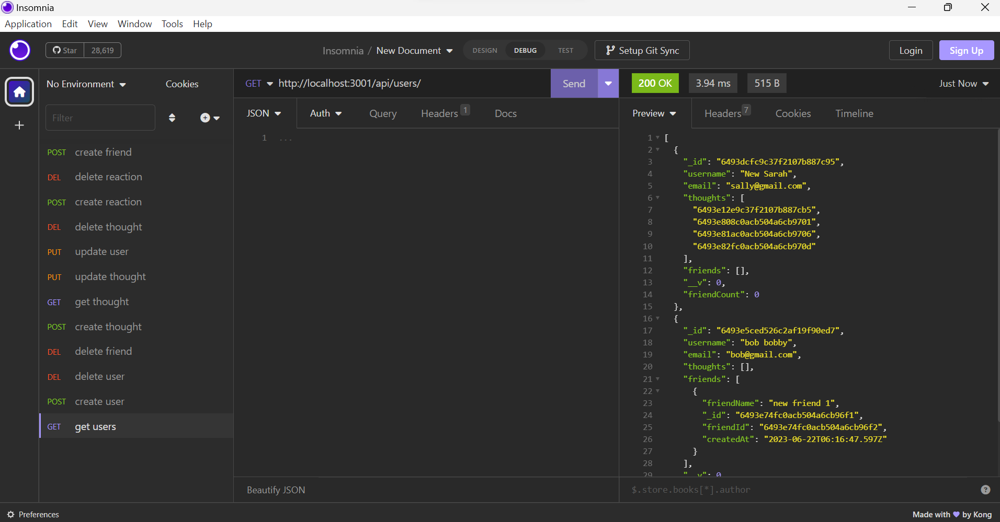
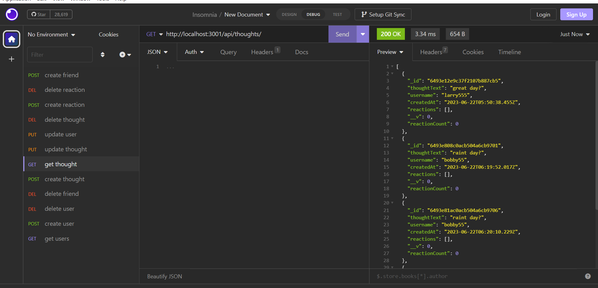
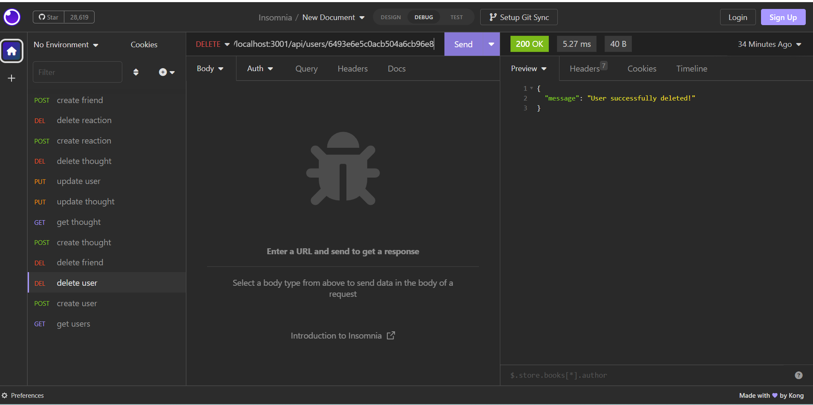

# MongoDB_API

  

   
  

  ## Description
  This Application allows you to view your Mongo database, to view specific information like Users , Thoughts and Reactions. Select the correct endpoints and you will be able to Create,Delete, Update, Get all the info you have stored.
  

   

## License
  
    Copyright 2023 Andy316C Licensed under the Apache License, Version 2.0 (the 'License'); you may not use this file except in compliance with the License. You may obtain a copy of the License at http://www.apache.org/licenses/LICENSE-2.0 Unless required by applicable law or agreed to in writing, software distributed under the License is distributed on an 'AS IS' BASIS, WITHOUT WARRANTIES OR CONDITIONS OF ANY KIND, either express or implied. See the License for the specific language governing permissions and limitations under the License.

   
  
  ## Table of contents
  <ol>
  <li><a href='#title'>Title</a></li>
  <li><a href='#desc'>Description</a></li>
  <li><a href='#install'>Installation</a></li>
  <li><a href='#cont'>Contribution</a></li>
  <li><a href='#test'>Testing</a></li>
  <li><a href='#images'>Images</a></li>
  <li><a href='#questions'>Questions</a></li>
  <li><a href='#contact'>Contact Info</a></li>
  </ol>
   

  

  ## Installation
  The application required multiple npm packages for successfull deployment, the pacakages required for the command requests, express to send/receive the request and mongoose to connect to the database of your business

  

   

  

  ## Contribution Guidelines
  Updates to Friends and Reactions only
  

   

  

  ## Testing
  Choose the request type (GET,DELETE,PUT,POST). Then enter the endpoint you would like to achive and the Data will be retrieved from MongDB
  

 
  

   
   

  ## Images
  Getting User details
  
   

  getting Thoughts details
  
   

  Delete a User
  
   
  
  

   
  
  

  
  ## Questions
  
  For questions or information please Email the following email address with your questions or concerns.
   

  Company Name: 
  Global Software CMS INC
   

  Company Email:  
  GlobalSoftwareCMSINC@gmail.com
  

   

  
  ## Contact Info
  Developers Name:  
  Andrew Clark
   

  Developers Email:  
  andy@gmail.com

  

   

 

## Screencastify video link

Click below for the video:

<a href= "https://drive.google.com/file/d/14VJvl46eEg00-O_XOpEEQVd6-uN5xpKn/view">walkthrough video </a>

   

  
